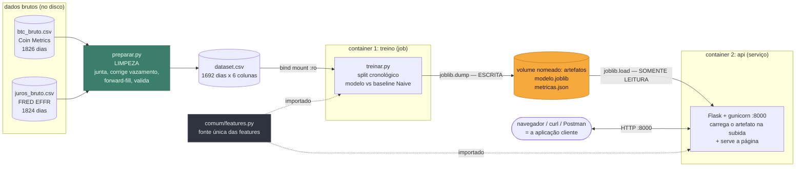
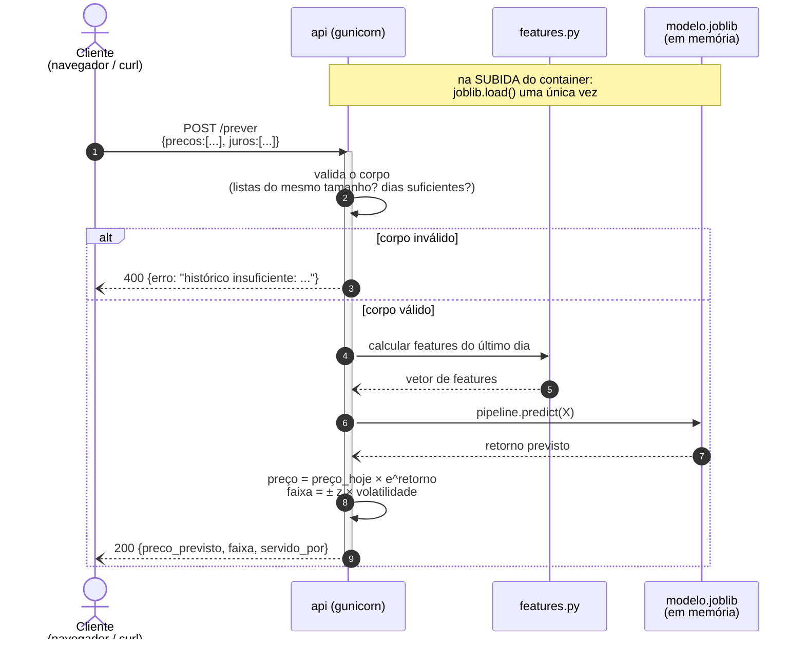
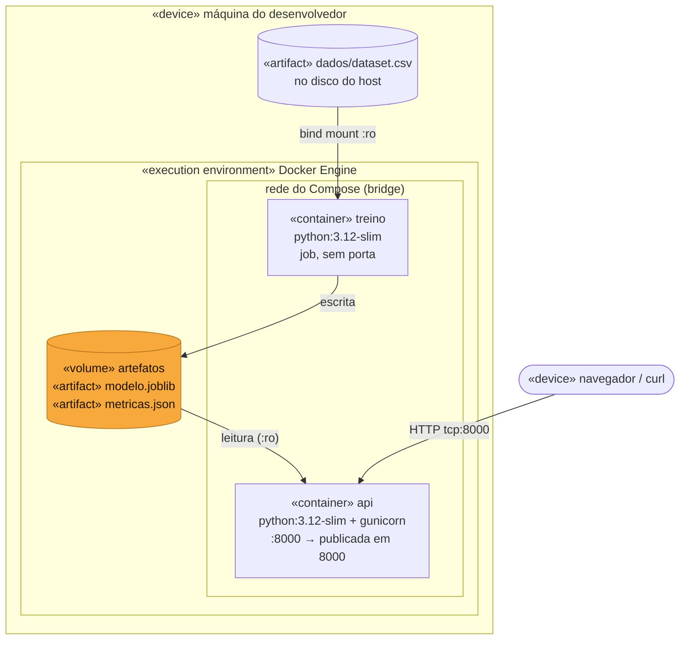
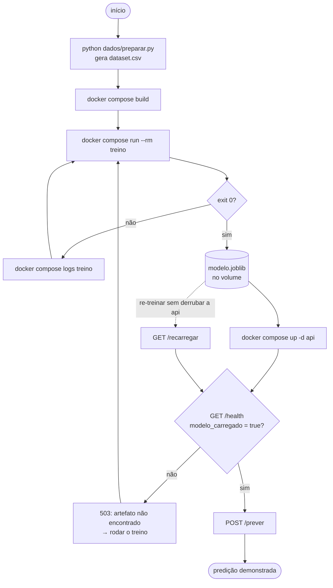

# Esboço UML da arquitetura

> Entregável 1 do enunciado: *"faça um esboço UML que represente os componentes
> da solução e a troca de dados entre eles. Inclua, no mínimo, o ambiente de
> treinamento, o artefato gerado pelo modelo, o container de inferência/backend
> e a aplicação cliente. **Indique como o modelo treinado chega ao container de
> inferência.**"*

**A resposta da pergunta em negrito, em uma frase:**

> O artefato chega por um **volume nomeado do Docker**. O container de treino
> monta o volume `artefatos` em modo escrita e grava `modelo.joblib`. O container
> de inferência monta **o mesmo volume em somente leitura** (`:ro`) e carrega o
> arquivo quando sobe. Os dois nunca se falam diretamente e não precisam estar no
> ar ao mesmo tempo — o contrato entre eles é o arquivo.

São **dois containers**, como o enunciado pede. A aplicação cliente é uma página
servida pela própria API, na mesma origem — assim não existe um terceiro
container nem problema de CORS.

---

## 1. Componentes — a visão geral



Três coisas para explicar na banca:

| Caixa | Por que ela importa |
|---|---|
| **laranja** (volume) | é a resposta da pergunta do enunciado: é por aqui que o modelo viaja |
| **verde** (`preparar.py`) | é a etapa de limpeza. Ela existe porque juntar BTC (7 dias/semana) com juros (só dia útil) deixa 31,6% das linhas sem juros observado |
| **cinza** (`features.py`) | é importado pelo treino **e** pela API. Se a conta das features fosse escrita duas vezes, elas divergiriam e o modelo receberia em produção números diferentes dos que viu treinando — *training/serving skew*. A API confere a lista de features do artefato na subida e acusa se diferir |

---

## 2. Sequência — o fluxo de uma predição



Notação: seta de **ponta cheia** = mensagem síncrona (quem chama espera a
resposta); seta **tracejada** = retorno; `alt` = caminho alternativo.

O caminho de erro está desenhado de propósito. Um diagrama de sequência que só
mostra o caso feliz está incompleto, e isso é fácil de perguntar na banca.

---

## 3. Implantação — onde cada coisa roda



Anotações que valem ponto:

| Anotação | Por quê |
|---|---|
| o `dataset.csv` entra como **bind mount `:ro`** | o treino lê o dado, nunca o altera; o CSV é a entrada versionada no Git |
| o volume é **`:ro` na api** | a inferência não pode corromper o artefato que o treino produziu |
| o treino **não tem porta** | é um job, não um serviço: roda, grava e termina com exit 0 |
| só a `api` publica porta | é o único componente que alguém de fora precisa alcançar |

---

## 4. Atividades — o ciclo de vida do modelo



O caminho pontilhado é o ganho concreto do desacoplamento: re-treinar e
recarregar **sem reiniciar** o container de inferência.

---

## 5. Como o artefato chega na inferência — as alternativas

O enunciado pede para *indicar* como o modelo chega ao container de inferência.
Existem quatro caminhos, e a escolha precisa de justificativa:

| Caminho | Como funciona | Prós | Contras | Usei? |
|---|---|---|---|---|
| **Volume nomeado** | treino grava, inferência lê o mesmo volume | re-treina sem rebuildar imagem; containers desacoplados; funciona offline | o volume é estado local, não versionado | ✅ **sim** |
| `COPY` na imagem | o artefato entra na imagem no build | imagem autocontida, boa para produção/CI | qualquer re-treino exige build e deploy novos |  não |
| Bind mount de pasta do host | `./artefatos:/artefatos` | dá para abrir o arquivo e inspecionar | depende do caminho e das permissões do host | não |
| Registry de modelos / S3 | a inferência baixa na subida | versiona o modelo, serve vários ambientes | precisa de rede, credencial e serviço externo | não |

**Justificativa:** dentro do tempo da atividade, o volume nomeado dá o
desacoplamento que o enunciado quer demonstrar sem introduzir dependência de
rede, credencial ou rebuild. E é o caminho que torna o fluxo **visível** —
que é o próximo item.

---

## 6. A demonstração que prova o diagrama

Em vez de só apontar para o desenho, dá para mostrar o artefato viajando:

```bash
docker compose down -v          # apaga o volume → o artefato morre
docker compose up -d api
curl -s localhost:8000/health   # modelo_carregado: false
curl -s localhost:8000/prever   # 503 modelo indisponível
docker compose run --rm treino  # re-treina, grava no volume
curl -s localhost:8000/recarregar
curl -s localhost:8000/prever   # volta a 200
```

Se o backend responde `503` quando o volume está vazio e `200` depois do treino,
está provado na frente de quem avalia que o modelo **passa por ali** e não está
embutido na imagem.

---

## Como exportar para imagem

Os blocos acima são Mermaid, e o GitHub renderiza direto no README. Para PNG no
slide:

1. <https://mermaid.live> — colar o bloco e exportar PNG/SVG; ou
2. `npx -y @mermaid-js/mermaid-cli -i uml/arquitetura.md -o uml/diagrama.png`
